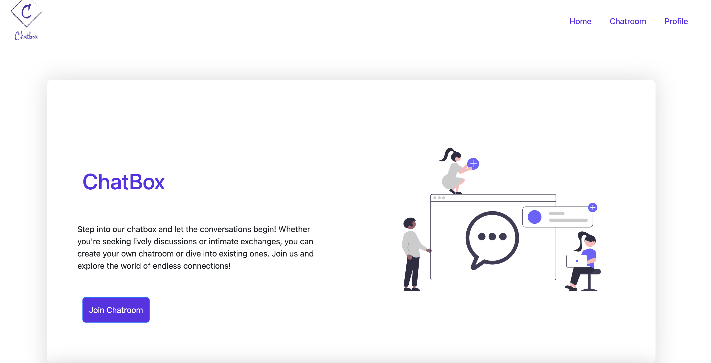

# 💬 Chatbox WebApp


A real-time chat application built using **Flask**, **Socket.IO**, and **HTML/CSS**.

---

## 🚀 Live Demo

🔗 [Visit Chatbox WebApp](https://chatbox-bp1o.onrender.com/)

---

## 🖼️ Screenshot




---

## 📖 About

**Chatbox WebApp** is a responsive, real-time chat platform where users can join or create chat rooms and talk instantly with others. Built using `Flask` and `Socket.IO`, it enables low-latency, bidirectional communication between clients and the server.

Whether you're casually chatting or hosting group conversations, Chatbox offers a simple yet reliable interface across devices.

---

## 🧩 Features

- 💬 Real-time messaging with Socket.IO
- 🏠 Multiple chat room support
- 📱 Mobile-friendly & responsive design
- ⚡ Lightweight and fast with Flask
- 🔒 Temporary session handling using Flask-Session

---

## 🛠️ Tech Stack

| Tech             | Description                       |
|------------------|-----------------------------------|
| **Flask**        | Python web framework              |
| **Socket.IO**    | Real-time event-based communication |
| **HTML/CSS**     | Frontend interface                |
| **Flask-Session**| Session management                |
| **Render**       | Hosting platform                  |

---

## 📦 Installation

```bash
# Clone the repository
git clone https://github.com/zealot-zew/Chatbox-Flask.git

# Navigate into the directory
cd Chatbox-Flask

# Install dependencies (create a virtualenv if needed)
pip install -r requirements.txt

# Run the server
python app.py


